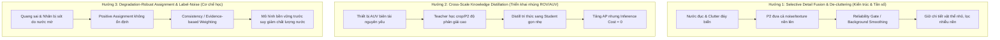

```mermaid
flowchart TD
    subgraph H1["Hướng 1: Selective Detail Fusion & De-cluttering (Kiến trúc & Tần số)"]
        A1["Nước đục & Clutter đáy biển"] --> B1["P2 đưa cả noise/texture nền lên"]
        B1 --> C1["Reliability Gate / Background Smoothing"]
        C1 --> D1["Giữ chi tiết vật thể nhỏ, lọc nhiễu nền"]
    end

    subgraph H2["Hướng 2: Cross-Scale Knowledge Distillation (Triển khai nhúng ROV/AUV)"]
        A2["Thiết bị AUV biên tài nguyên yếu"] --> B2["Teacher học crop/P2 độ phân giải cao"]
        B2 --> C2["Distill tri thức sang Student gọn nhẹ"]
        C2 --> D2["Tăng AP nhưng Inference Cost = 0"]
    end

    subgraph H3["Hướng 3: Degradation-Robust Assignment & Label-Noise (Cơ chế học)"]
        A3["Quang sai & Nhãn bị sót do nước mờ"] --> B3["Positive Assignment không ổn định"]
        B3 --> C3["Consistency / Evidence-based Weighting"]
        C3 --> D3["Mô hình bền vững trước suy giảm chất lượng nước"]
    end
```